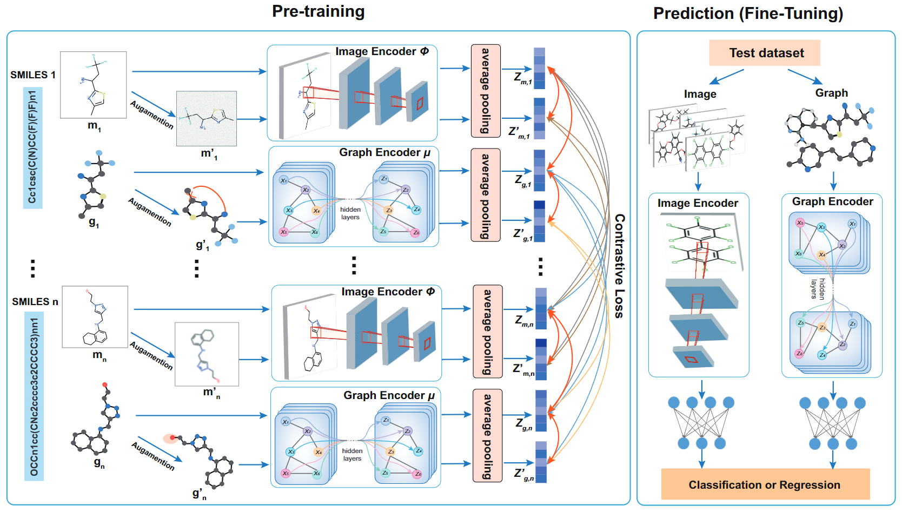

# Contrastive Graph-Image Pre-training (CGIP)

Official PyTorch-based implementation in the paper [Chemical Structure-Aware Molecular Image Representation Learning](https://doi.org/10.1093/bib/bbad404), which is a simple and effective Contrastive Graph-Image Pre-training (CGIP) framework for molecular representation learning.

<div>
<a href="https://github.com/HongxinXiang/CGIP/blob/master/LICENSE">
    
</a>
</div>


## News!

**[2024/09/06]** Add some experiments and discoveries by exploring gap between graph-image CL and graph-geometry CL.

**[2023/10/20]** Accepted in *Briefings in Bioinformatics*.

**[2022/11/17]** Repository installation completed.


## Updates!

### 2024.09.06 Exploration experiments between graph-image CL and graph-geometry CL

We would like to add some new results to CGIP. 

**Experimental Motivations:** Helps us clarify the gap between graph-image contrastive learning (CL) and graph-geometry contrastive learning (GraphMVP) under strict scaffold split conditions through this clearer comparison.

The experimental setup is as follows:

- **Pre-training dataset:** 2 million molecules from [IEM](https://www.ijcai.org/proceedings/2024/675). If you want the data, please click [the link](https://1drv.ms/u/s!Atau0ecyBQNTgRH30gPFlqS5CO5v?e=Qj69TB) to download
- **We follow the settings of GraphMVP**. The information in the following items is consistent with GraphMVP:
  - Graph Encoder: GIN.
  - Pre-training data size: 2 million molecules.
- Random seeds = 0,1, 2.

We pre-trained GIN for 10 epochs according to the CGIP code. The checkpoints are follows:

| Model                                  | Checkpoint                                                   | Description                                                  |
| -------------------------------------- | ------------------------------------------------------------ | ------------------------------------------------------------ |
| ckpt_epoch=9_loss=0.22_CGIP_no_aug.pth | [OneDrive](https://1drv.ms/u/s!Atau0ecyBQNThm4lveWp7EokNBkC?e=8TfTUb) | Only retains the cross-modal loss and removes the intra-modal loss based on data augmentation. |
| ckpt_epoch=9_loss=0.42_CGIP.pth        | [OneDrive](https://1drv.ms/u/s!Atau0ecyBQNThm3OzY19qJ04Na71?e=dy7fQd) | CGIP                                                         |

We evaluate GIN model in these checkpoints on 8 molecular property prediction tasks (classification tasks and using ROC-AUC metric).

|                    | BBBP       | Tox21      | ToxCast    | Sider      | ClinTox    | MUV        | HIV        | Bace       | Avg       |
| ------------------ | ---------- | ---------- | ---------- | ---------- | ---------- | ---------- | ---------- | ---------- | --------- |
| -                  | 65.4(2.4)  | 74.9(0.8)  | 61.6(1.2)  | 58.0(2.4)  | 58.8(5.5)  | 71.0(2.5)  | 75.3(0.5)  | 72.6(4.9)  | 67.21     |
| InfoGraph          | 69.2(0.8)  | 73.0(0.7)  | 62.0(0.3)  | 59.2(0.2)  | 75.1(5.0)  | 74.0(1.5)  | 74.5(1.8)  | 73.9(2.5)  | 70.10     |
| GraphCL            | 67.5(3.3)  | 75.0(0.3)  | 62.8(0.2)  | 60.1(1.3)  | 78.9(4.2)  | 77.1(1.0)  | 75.0(0.4)  | 68.7(7.8)  | 70.64     |
| GraphMVP           | 68.5(0.2)  | 74.5(0.4)  | 62.7(0.1)  | 62.3(1.6)  | 79.0(2.5)  | 75.0(1.4)  | 74.8(1.4)  | 76.8(1.1)  | 71.69     |
| **CGIP**           | 68.47(0.7) | 74.86(0.5) | 61.44(1.2) | 59.87(1.6) | 85.96(1.2) | 74.30(3.3) | 74.31(0.8) | 76.34(2.5) | **71.94** |
| **CGIP (w/o aug)** | 69.49      | 74.73      | 62.80      | 59.40      | 86.33      | 71.94      | 76.36      | 76.80      | **72.23** |

Please note that :

- Since this is a simple exploratory experiment, the goal is to take a glimpse at the potential of CGIP by comparing with graph-image CL and graph-geometry CL, and we did not do any optimization on CGIP. That is why you can see that CGIP is not as good as CGIP_no_aug, whose loss has not yet fully converged (loss=0.42>0.22).
- Except for CGIP, other results are directly copied from GraphMVP. Since there is too much data, we did not paste all the results here. If you are interested, you can go to the original paper of GraphMVP. GraphMVP-G and GraphMVP-C are not considered here because they introduce non-contrastive learning methods.
- Sorry, we forgot to calculate the variance of CGIP (w/o aug).

**Conclusion:**

- 2D images give GIN more performance gains than 3D geometry (GraphMVP). 

In addition, we will have another work to further discuss this matter, so stay tuned.


## Abstract

Current methods of molecular image-based drug discovery face two major challenges: 1) work effectively in absence of labels, 2) capture chemical structure from implicitly encoded images. Given that chemical structures are explicitly encoded by molecular graphs (such as nitrogen, benzene rings and double bonds), we leverage self-supervised contrastive learning to transfer chemical knowledge from graphs to images. Specifically, we propose a novel Contrastive Graph-Image Pre-training (CGIP) framework for molecular representation learning, which learns explicit information in graphs and implicit information in images from large-scale unlabeled molecules via carefully designed intra- and inter-modal contrastive learning. We evaluate the performance of CGIP on multiple experimental settings (molecular property prediction, cross-modal retrieval and distribution similarity), and the results show that CGIP can achieve state-of-the-art performance on all 12 benchmark datasets and demonstrate that CGIP transfers chemical knowledge in graphs to molecular images, enabling image encoder to perceive chemical structures in images. We hope this simple and effective framework will inspire people to think about the value of image for molecular representation learning.




## Environments

#### 1. GPU environment

CUDA 10.1

Ubuntu 18.04


#### 2. create conda environment

```bash
conda create -n CGIP python=3.7.3
source activate CGIP

conda install -c rdkit rdkit
conda install pytorch==1.6.0 torchvision==0.7.0 cudatoolkit=10.1 -c pytorch
pip install torch-cluster torch-scatter torch-sparse torch-spline-conv -f https://pytorch-geometric.com/whl/torch-1.6.0%2Bcu101.html
pip install torch-geometric==1.6.0
pip install dgl-cu101
pip install ogb
pip install tensorboard
pip install -r requirements.txt
```


## Pre-training

#### 1. preparing dataset for pre-training

You can download [pretraining data](https://drive.google.com/file/d/1t1Ws-wPYPeeuc8f_SGgnfUCVCzlM_jUJ/view?usp=sharing) and push it into the folder `datasets/pre-training/`.

The data root should be as follows:

```bash
├─[dataroot]
│  └─[dataset]
│  |   ├─raw
│  |     └── [dataset].csv
```


#### 2. preprocessing pre-training dataset

```python
python ./dataloader/initialize_dual_dataset.py --dataroot {your dataroot} --dataset {your dataset}
# you can use the following code for pre-training the downloaded data:
python ./dataloader/initialize_dual_dataset.py --dataroot ./datasets/pre-training/ --dataset data
```

You can run code to generate toy data:

```bash
python ./dataloader/initialize_dual_dataset.py --dataroot ./datasets/pre-training/ --dataset toy
```


After executing this command, the structure of data root is changed to:

```bash
├─[dataroot]
│  └─[dataset]
│  |   ├─raw
│  |     └── [dataset].csv
│  |   ├─processed  # this folder is newly created.
│  |     ├── 224
│  |     |   └── 1.png
│  |     |   └── 2.png
│  |     |   └── ...
│  |     └── geometric_data_processed.pt
│  |     └── [dataset]_processed_ac.csv
```


#### 3. run command to pre-train

Usage:

```bash
usage: pretrain_cgip.py [-h] [--dataset DATASET] [--dataroot DATAROOT]
                        [--n_device N_DEVICE] [--gpu GPU] [--workers WORKERS]
                        [--lr LR] [--weight_decay WEIGHT_DECAY]
                        [--num_layers NUM_LAYERS] [--t_dropout T_DROPOUT]
                        [--feat_dim FEAT_DIM]
                        [--pretrained_pth PRETRAINED_PTH]
                        [--load_optim_scheduler] [--seed SEED]
                        [--epochs EPOCHS] [--start_epoch START_EPOCH]
                        [--batch BATCH] [--resume PATH]
                        [--imageSize IMAGESIZE] [--image_model IMAGE_MODEL]
                        [--temperature TEMPERATURE]
                        [--base_temperature BASE_TEMPERATURE]
                        [--lr_decay_epoch LR_DECAY_EPOCH]
                        [--graph_aug GRAPH_AUG]
                        [--graph_aug_ratio GRAPH_AUG_RATIO]
                        [--n_ckpt_save N_CKPT_SAVE]
                        [--n_batch_step_optim N_BATCH_STEP_OPTIM]
                        [--n_sub_checkpoints_each_epoch N_SUB_CHECKPOINTS_EACH_EPOCH]
                        [--log_dir LOG_DIR]
```


Code to pretrain CGIP framework:

```python
pretrain_cgip.py --dataroot ./datasets/pre-training/ \
                 --dataset data \
                 --batch 512 \
                 --num_layers 14 \
                 --t_dim 512 \
                 --temperature 0.1 \
                 --base_temperature 0.1 \
                 --lr 0.01 \
                 --graph_aug none+dropN+permE+maskN \
                 --lr_decay_epoch 1 \
                 --epochs 10 \
                 --workers 3 \
                 --n_batch_step_optim 1 \
                 --n_sub_checkpoints_each_epoch 4 \
                 --log_dir ./experiments/pretrain_cgip/
```


**For convenience, you can execute pre-training code using toy dataset, as following:**

```bash
python pretrain_cgip.py --dataroot ./datasets/pre-training --dataset toy --epochs 10 --batch 8 --graph_aug none+dropN+permE+maskN --log_dir ./experiments/pretrain_cgip_on_toy/ --n_sub_checkpoints_each_epoch 0
```


## Fine-tuning

#### 1. preparing pretrained model

Download [pre-trained model](https://drive.google.com/file/d/14-GytnIJ8P2F8hEGJcUivi90xYAwWezc/view?usp=share_link) and push it into the folder `ckpts/`


#### 2. preparing downstream datasets

Download [molecular property prediction datasets](https://drive.google.com/file/d/1y0924eaA7gH6RhoSz7efxI6ap_4COj23/view?usp=share_link) and push them into the folder `datasets/fine-tuning/`


#### 3. fine-tuning with pretrained model

Usage of CGIP-DeeperGCN:

```bash
usage: finetune_deepergcn.py [-h] [--dataroot DATAROOT] [--dataset DATASET]
                             [--workers WORKERS] [--batch BATCH]
                             [--add_virtual_node] [--graph_aug GRAPH_AUG]
                             [--graph_aug_ratio GRAPH_AUG_RATIO] [--use_gpu]
                             [--device DEVICE] [--epochs EPOCHS] [--seed SEED]
                             [--lr LR] [--dropout DROPOUT]
                             [--grad_clip GRAD_CLIP] [--split_path SPLIT_PATH]
                             [--save_finetune_ckpt {0,1}]
                             [--num_layers NUM_LAYERS]
                             [--mlp_layers MLP_LAYERS]
                             [--hidden_channels HIDDEN_CHANNELS]
                             [--block BLOCK] [--conv CONV]
                             [--gcn_aggr GCN_AGGR] [--norm NORM]
                             [--num_tasks NUM_TASKS] [--runseed RUNSEED]
                             [--t T] [--p P] [--learn_t] [--learn_p] [--y Y]
                             [--learn_y] [--msg_norm] [--learn_msg_scale]
                             [--conv_encode_edge]
                             [--graph_pooling GRAPH_POOLING]
                             [--log_dir LOG_DIR] [--resume PATH]
                             [--task_type {classification,regression}]
```


Usage of CGIP-ResNet18:

```bash
usage: finetune_resnet18.py [-h] [--dataset DATASET] [--dataroot DATAROOT]
                            [--use_gpu] [--device DEVICE] [--workers WORKERS]
                            [--lr LR] [--weight_decay WEIGHT_DECAY]
                            [--momentum MOMENTUM] [--runseed RUNSEED]
                            [--epochs EPOCHS] [--start_epoch START_EPOCH]
                            [--batch BATCH] [--resume PATH]
                            [--imageSize IMAGESIZE] [--image_aug]
                            [--task_type {classification,regression}]
                            [--save_finetune_ckpt {0,1}] [--log_dir LOG_DIR]
```


For examples, you can run the following code to fine-tune:

- CGIP-DeeperGCN:

  ```bash
  python finetune_deepergcn.py --dataroot ./datasets/fine-tuning/ --dataset bbbp --resume ./ckpts/CGIP.pth --lr 0.005 --batch 16 --epochs 60 --runseed 0 --task_type classification --log_dir ./experiments/graph/ --use_gpu --device 0
  ```

- CGIP-ResNet18:

  ```bash
  python finetune_resnet18.py --dataroot ./datasets/fine-tuning/ --dataset bbbp --resume ./ckpts/CGIP.pth --lr 0.005 --batch 16 --epochs 60 --image_aug --runseed 0 --task_type classification --log_dir ./experiments/image/ --use_gpu --device 0
  ```


## Reproduces

#### 1. Finetuned models

To ensure the reproducibility of CGIP, we provided finetuned models for eight datasets, including:

| No   | Datasets | CGIP-DeeperGCN                                               | CGIP-ResNet18                                                |
| ---- | -------- | ------------------------------------------------------------ | ------------------------------------------------------------ |
| 1    | BACE     | [cgip-deepergcn-bace.pth](https://drive.google.com/file/d/1x4ymc6B2OVO-DnVi72CYwCHNFFlK6jtF/view?usp=share_link) | [cgip-resnet18-bace.pth](https://drive.google.com/file/d/1gY7c5k2p045HH3Uo_nuAL-kEm94Yz6VU/view?usp=share_link) |
| 2    | BBBP     | [cgip-deepergcn-bbbp.pth](https://drive.google.com/file/d/19NaKotEmnVzL3OqxpklVBaGLa0UmAeAm/view?usp=share_link) | [cgip-resnet18-bbbp.pth](https://drive.google.com/file/d/18igSrCjN07YpxQwJHu9evEHkB5tj6XUc/view?usp=share_link) |
| 3    | ClinTox  | [cgip-deepergcn-clintox.pth](https://drive.google.com/file/d/1MtXDt43lUvXKHBS-UA9YJcY8E9OjKoZO/view?usp=share_link) | [cgip-resnet18-clintox.pth](https://drive.google.com/file/d/1DsaAGWCnXkzz-K5JHc59WFDDAsySt8rL/view?usp=share_link) |
| 4    | Estrogen | [cgip-deepergcn-estrogen.pth](https://drive.google.com/file/d/1ynaKtYrakEOsHtOIZps4q9LS-_JmFL_O/view?usp=share_link) | [cgip-resnet18-estrogen.pth](https://drive.google.com/file/d/1i6qmMPpCMDTZBqLdNQndgMvGmFjATbhm/view?usp=share_link) |
| 5    | MetStab  | [cgip-deepergcn-metstab.pth](https://drive.google.com/file/d/1tv_05Z4VkbvnwpDNDHmWhz-X4YXZluem/view?usp=share_link) | [cgip-resnet18-metstab.pth](https://drive.google.com/file/d/1wGryoehjYAJ8T2jFGIFFpR1LJEOkprBJ/view?usp=share_link) |
| 6    | Sider    | [cgip-deepergcn-sider.pth](https://drive.google.com/file/d/1l8jgqxkOf-vxt4zYZi1Hd-mF81-vu34I/view?usp=share_link) | [cgip-resnet18-sider.pth](https://drive.google.com/file/d/1kac6-JroWpjpbhLXs0P7NNxK4L3Z0Dk9/view?usp=share_link) |
| 7    | Tox21    | [cgip-deepergcn-tox21.pth](https://drive.google.com/file/d/1kQxOpHCH32VAFWW_N3OEUqJQzXSRfvgD/view?usp=share_link) | [cgip-resnet18-tox21.pth](https://drive.google.com/file/d/1GHBmZ2S9R-14LyfdWPrJXxx3xu9Ph7N6/view?usp=share_link) |
| 8    | ToxCast  | [cgip-deepergcn-toxcast.pth](https://drive.google.com/file/d/1WylBt2X8C5zA1RjFgxn8MAVe4-vrEy9S/view?usp=share_link) | [cgip-resnet18-toxcast.pth](https://drive.google.com/file/d/14KbQ7VzQqqmf5Yz1cOeoj24SVUMGfOle/view?usp=share_link) |


Usage of CGIP-DeeperGCN:

```bash
usage: evaluate_deepergcn.py [-h] [--dataroot DATAROOT] [--dataset DATASET]
                             [--workers WORKERS] [--batch BATCH]
                             [--add_virtual_node] [--graph_aug GRAPH_AUG]
                             [--graph_aug_ratio GRAPH_AUG_RATIO] [--use_gpu]
                             [--device DEVICE] [--epochs EPOCHS] [--seed SEED]
                             [--lr LR] [--dropout DROPOUT]
                             [--grad_clip GRAD_CLIP] [--split_path SPLIT_PATH]
                             [--save_finetune_ckpt {0,1}]
                             [--num_layers NUM_LAYERS]
                             [--mlp_layers MLP_LAYERS]
                             [--hidden_channels HIDDEN_CHANNELS]
                             [--block BLOCK] [--conv CONV]
                             [--gcn_aggr GCN_AGGR] [--norm NORM]
                             [--num_tasks NUM_TASKS] [--runseed RUNSEED]
                             [--t T] [--p P] [--learn_t] [--learn_p] [--y Y]
                             [--learn_y] [--msg_norm] [--learn_msg_scale]
                             [--conv_encode_edge]
                             [--graph_pooling GRAPH_POOLING]
                             [--log_dir LOG_DIR] [--resume PATH]
                             [--task_type {classification,regression}]
```


Usage of CGIP-ResNet18:

```bash
usage: evaluate_resnet18.py [-h] [--dataset DATASET] [--dataroot DATAROOT]
                            [--use_gpu] [--device DEVICE] [--workers WORKERS]
                            [--batch BATCH] [--resume PATH]
                            [--imageSize IMAGESIZE] [--image_aug]
                            [--task_type {classification,regression}]
```


#### 2. reproducing results

You can evaluate the finetuned model by using the following command:

- CGIP-DeeperGCN:

  ```bash
  python evaluate_deepergcn.py --dataroot ./datasets/fine-tuning/ --dataset bbbp  --task_type classification --resume ./ckpts/deepergcn/bbbp.pth --batch 32 --use_gpu --device 0
  ```

- CGIP-ResNet18:

  ```bash
  python evaluate_resnet18.py --dataroot ./datasets/fine-tuning/ --dataset bbbp --task_type classification --resume ./ckpts/resnet18/bbbp.pth --batch 32 --use_gpu --device 0
  ```


# Reference

If you use CGIP in scholary publications, presentations or to communicate with your satellite, please cite the following work that presents the algorithms used:
```bib
@article{10.1093/bib/bbad404,
    author = {Xiang, Hongxin and Jin, Shuting and Liu, Xiangrong and Zeng, Xiangxiang and Zeng, Li},
    title = "{Chemical structure-aware molecular image representation learning}",
    journal = {Briefings in Bioinformatics},
    volume = {24},
    number = {6},
    pages = {bbad404},
    year = {2023},
    month = {11},
    issn = {1477-4054},
    doi = {10.1093/bib/bbad404},
    url = {https://doi.org/10.1093/bib/bbad404},
    eprint = {https://academic.oup.com/bib/article-pdf/24/6/bbad404/53471469/bbad404.pdf},
}
```